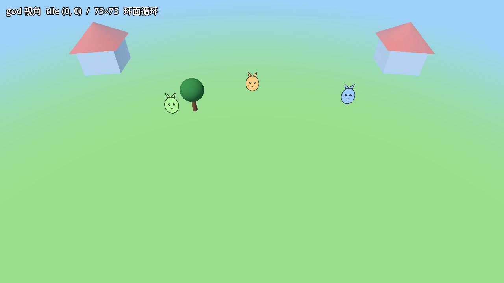
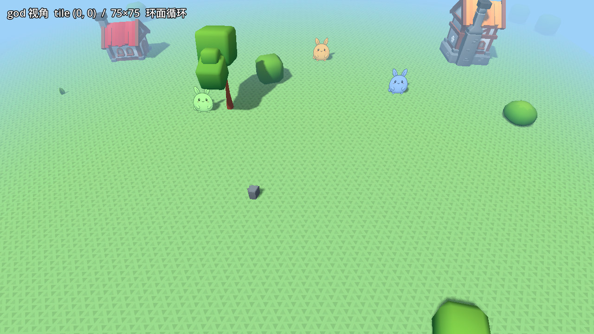

# 美术演进记录

同机位（god 视角，主场景启动第 5 帧，`godot --write-movie` 截取）的前后对比。

## 2026-07-02 · KayKit 资产替换（merge `8083ee7`）

程序化色块世界 → KayKit CC0 资产（Forest Nature + Medieval Hexagon）+
动森式三角草纹 + 方向光阴影恢复 + critter 占位图换管线生成小兔。

| 改造前 | 改造后 |
|---|---|
|  |  |
